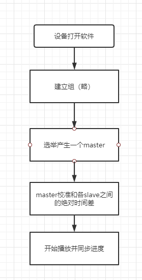

# MultiDeviceDemo

#### 介绍
**拼接屏同步工具**

拼接屏方案通常由硬件完成，如硬件直接拆分HDMI中的像素，投放到屏幕中。此项目通过软件使拆分后的视频能在不同的设备中播放并尽量维持时间同步；

#### 软件架构



#### 核心原理

**校准**

假设机器时间误差T，网络延迟TTL，此时 设备A 时间 TA1； 设备B 时间 TB1 ；播放进度为P

1. A发送指令
2. B收到指令立刻回发
3. A收到回复指令，此时时间TA2

```
TA2-TA1 = 2TTL
TTL = (TA2-TA1)/2
T= TA2-(TB + TTL)
```

当TTL小于50ms时，可以确保机器绝对时间误差小于50ms

**调度**

1. 设备A发送调度请求 【P】
2. 设备B接收到请求，计算本次 TTL = TB + T - TA，则此时理想进度 P = P + TTL


#### 安装教程

````gradle
allprojects {
	repositories {
		...
		maven { url 'https://jitpack.io' }
	}
}
````
````gradle
dependencies {
    implementation 'com.sloth.multidevicesync:ZFPlayer:Tag'
}
````

#### 使用说明

```java
SyncCenter.startSync(
    this,
    //局域网组名
    "9998877",
    //设备名
    "dev-" + Utils.random().nextInt(127),
    //资源类型和地址
     new SyncSource(SyncSource.SourceType.Image.code, Test.getNana())
);

```

```java
SyncCenter.stopSync();

```


#### 参与贡献

1.  Fork 本仓库
2.  新建 Feat_xxx 分支
3.  提交代码
4.  新建 Pull Request
